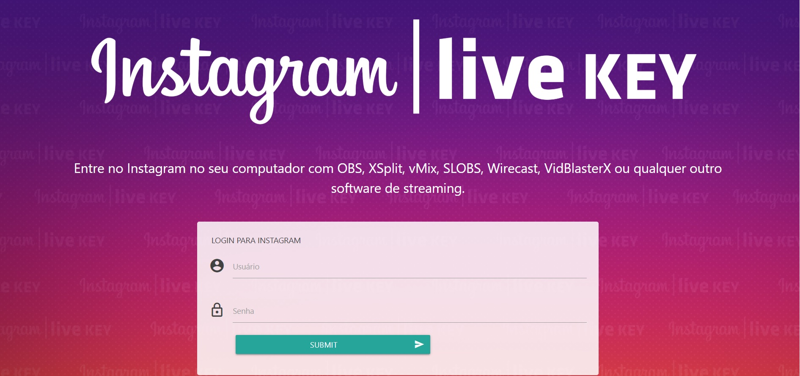
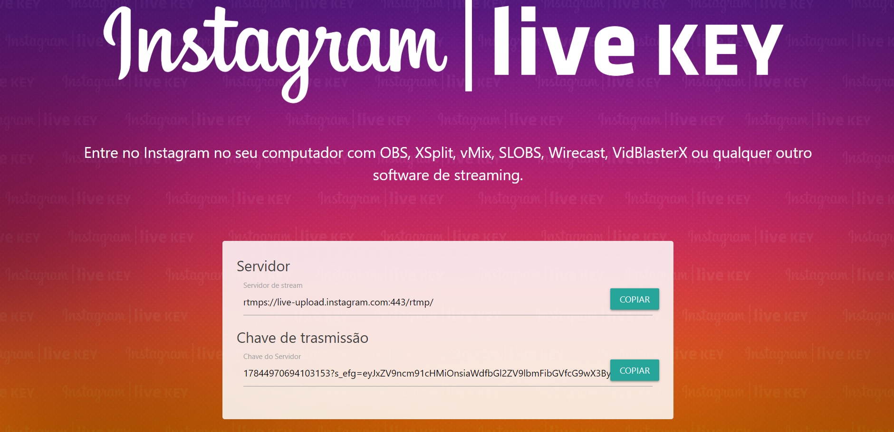

# InstagramLiveKey
Programa em PHP para obter Chave de streaming do instagram (Video ao vivo)
Entre no Instagram no seu computador com OBS, XSplit, vMix, SLOBS, Wirecast, VidBlasterX ou qualquer outro software de streaming.

    ALERTA!!! o Instagram anunciou que esta API será substituida em junho de 2020. 

## Uso
    O uso é simples, apenas execute um servidor php, acesse o index e digite seu usuário e senha.
    Espere o servidor e chave serem carregadas.

## observação:
O código não suporta autenticação de 2 fatores e também não contorna problemas com CHALLENGE.

